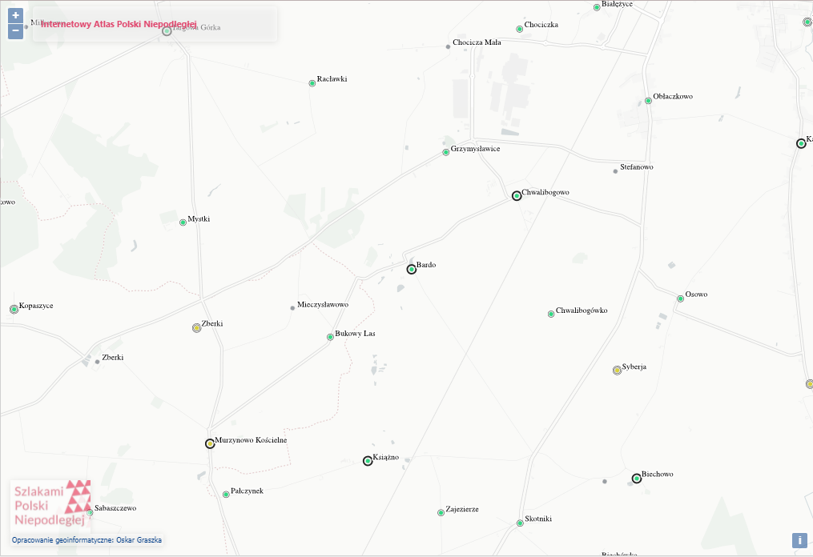

[< główna](../README.md)
# Bardo
## Nazwiska
+ Łuczak
+ Mizerkiewicz
+ Piątek
+ Stanisławski / Stanisławska
+ Wański / Wańska

## Metryki
+ Archiwum Państwowe w Poznaniu: Akta stanu cywilnego Parafii Rzymskokatolickiej Bardo (pow. wrzesiński) [www.szukajwarchiwach.gov.pl/zespol/-/zespol/20597 ](https://www.szukajwarchiwach.gov.pl/zespol/-/zespol/20597)
+ FamilySearch: Mikrofilmy zrobione z rękopisów w Archiwum Archidiecezjalnego w Gnieźnie [www.familysearch.org/search/catalog/results?count=20&query=%2Bauthor_id%3A592769](https://www.familysearch.org/search/catalog/results?count=20&query=%2Bauthor_id%3A592769)

## Indeksy
+ Geneteka: Indeksy mojego autorstwa z ksiąg metrykalnych w AA Gniezno [geneteka.genealodzy.pl/index.php?op=gt&lang=pol&bdm=B&w=15wp&rid=8803](https://geneteka.genealodzy.pl/index.php?op=gt&lang=pol&bdm=B&w=15wp&rid=8803)

## Linki
+ Billiongraves: Zdjęcia i wyszukiwarka z cmentarza parafialnego [billiongraves.pl/cemetery/Bardo-cmentarz/312276](https://billiongraves.pl/cemetery/Bardo-cmentarz/312276)
+ Wykaz uczniów z nieistniejącej szkoły powszechnej w Bardzie k. Wrześni, uczęszczających w latach 1874-1923 - oprac. Jarosław Górski [wtg-gniazdo.org/upload/opracowania/uczniowie_Bardo.xls](http://wtg-gniazdo.org/upload/opracowania/uczniowie_Bardo.xls)

## Lokalizajca

