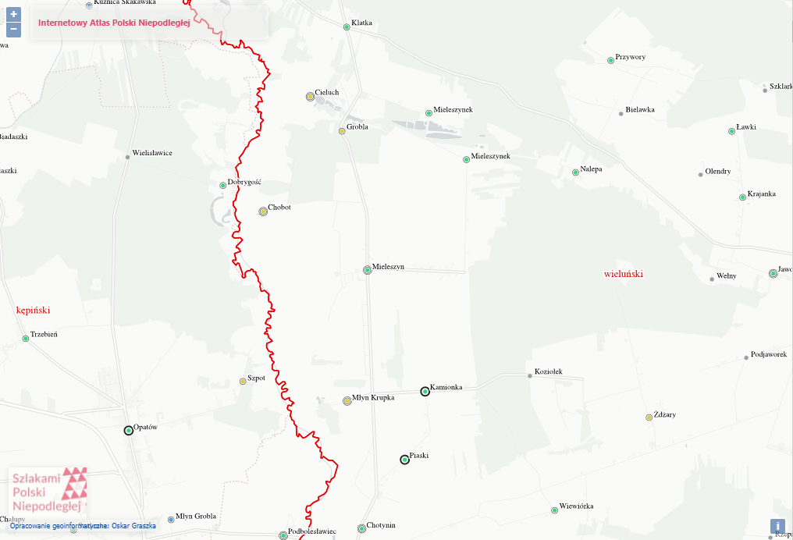

[< główna](../README.md)
# Mieleszyn
Wieś w Polsce położona w województwie łódzkim, w powiecie wieruszowskim, w gminie Bolesławiec.

## Nazwiska
+ Kmiecik
+ Wyczyniacz
+ Ferdynus
+ Zuzek

## Metryki
+ PTG Metryki (AP Łódź): [metryki.genealodzy.pl/ar3-zs1584d](https://metryki.genealodzy.pl/ar3-zs1584d)
+ Genbaza (AP Łódź): [metryki.genbaza.pl/genbaza,list,55801,1](https://metryki.genbaza.pl/genbaza,list,55801,1)
+ FamilySearch (AP Łódź, AP Kalisz, AA Częstochowa): [www.familysearch.org/search/catalog/results?count=20&query=%2Bsubject_id%3A380440](https://www.familysearch.org/search/catalog/results?count=20&query=%2Bsubject_id%3A380440)
+ Szukaj w Archiwach: Akta stanu cywilnego Parafii Rzymskokatolickiej w Mieleszynie: [www.szukajwarchiwach.gov.pl/zespol/-/zespol/73991](https://www.szukajwarchiwach.gov.pl/zespol/-/zespol/73991)

## Indeksy
+ Geneteka: [geneteka.genealodzy.pl/index.php?op=gt&lang=pol&bdm=B&w=05ld&rid=6673](https://geneteka.genealodzy.pl/index.php?op=gt&lang=pol&bdm=B&w=05ld&rid=6673)
+ Strona rodzinno-regionalna GLĄDAŁÓW:
    + Urodzenia: [gladala.com/mieleszyn-urodzenia-1747/](https://gladala.com/mieleszyn-urodzenia-1747/)
    + Małżeństwa: [gladala.com/mieleszyn-malzenstwa-od-1747-roku/](https://gladala.com/mieleszyn-malzenstwa-od-1747-roku/)
    + Zgony: [gladala.com/mieleszyn-zgony-1747/](https://gladala.com/mieleszyn-zgony-1747/)

## Spis ludności
+ Indeks spisu ludności 1790-1791: [gladala.com/mieleszyn-spis-ludnosci-z-1790-1791-roku/](https://gladala.com/mieleszyn-spis-ludnosci-z-1790-1791-roku/)
+ Indeks spisu ludności 1791 [gladala.com/parafia-mieleszyn-spis-ludnosci-z-1791-roku/](https://gladala.com/parafia-mieleszyn-spis-ludnosci-z-1791-roku/)
+ Zdjęcia spisu ludności z 1790-1791 roku autrstwa p. Piotra Glądały z Projektu Prosna: [www.flickr.com/photos/191646849@N06/albums/72157717704621683](https://www.flickr.com/photos/191646849@N06/albums/72157717704621683)

## Linki
+ Słownik geograficzny Królestwa Polskiego: [dir.icm.edu.pl/pl/Slownik_geograficzny/Tom_VI/342](http://dir.icm.edu.pl/pl/Slownik_geograficzny/Tom_VI/342)
+ BillionGraves: [billiongraves.pl/cemetery/Mieleszyn-cmentarz/311620](https://billiongraves.pl/cemetery/Mieleszyn-cmentarz/311620)
+ KZM: [parafie.genealodzy.pl/index.php?op=pr&pid=5043](https://parafie.genealodzy.pl/index.php?op=pr&pid=5043)
+ Projekt Prosna na FB: [www.facebook.com/groups/ProjektProsna/](https://www.facebook.com/groups/ProjektProsna/)

## Lokalizajca
