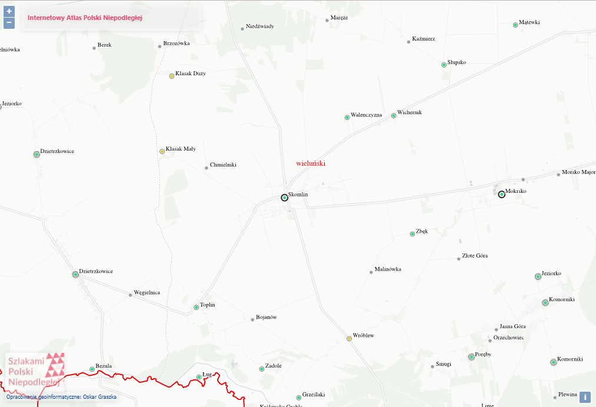

[< główna](../README.md)
# Skomlin
Wieś w Polsce położona w województwie łódzkim, w powiecie wieluńskim, w gminie Skomlin.

## Nazwiska
+ Kmiecik
+ Majtyka
+ Caban
+ Słonina
+ Leń / Leniak
+ Dybek
+ Szynczewski

## Metryki
+ PTG Metryki (AP Łódź): [metryki.genealodzy.pl/ar3-zs1667d](https://metryki.genealodzy.pl/ar3-zs1667d)
+ Genbaza (AP Łódź): [metryki.genbaza.pl/genbaza,list,51861,1](https://metryki.genbaza.pl/genbaza,list,51861,1)
+ FamilySearch (AP Łódź, AA Łódź, AA Częstochowa): [www.familysearch.org/search/catalog/results?count=20&query=%2Bsubject_id%3A374110](https://www.familysearch.org/search/catalog/results?count=20&query=%2Bsubject_id%3A374110)
+ Szukaj w Archiwach: Akta stanu cywilnego Parafii Rzymskokatolickiej w Skomlinie: [www.szukajwarchiwach.gov.pl/zespol/-/zespol/74074](https://www.szukajwarchiwach.gov.pl/zespol/-/zespol/74074)

## Indeksy
+ Geneteka: [geneteka.genealodzy.pl/index.php?op=gt&lang=pol&bdm=B&w=05ld&rid=4282](https://geneteka.genealodzy.pl/index.php?op=gt&lang=pol&bdm=B&w=05ld&rid=4282)

## Spis ludności
+ Indeks spis lubności z 1790: [gladala.com/parafia-skomlin-spis-ludnosci-z-1791-roku/](https://gladala.com/parafia-skomlin-spis-ludnosci-z-1791-roku/)
+ Zdjęcia spisu ludności z 1790-1791 roku autrstwa p. Piotra Glądały z Projektu Prosna: [www.flickr.com/photos/191646849@N06/sets/72177720296137429](https://www.flickr.com/photos/191646849@N06/sets/72177720296137429)

## Linki
+ Słownik geograficzny Królestwa Polskiego: [dir.icm.edu.pl/pl/Slownik_geograficzny/Tom_X/691](http://dir.icm.edu.pl/pl/Slownik_geograficzny/Tom_X/691)
+ Genealogia Wieluń na FB: [www.facebook.com/groups/GenealogiaWielun](https://www.facebook.com/groups/GenealogiaWielun)
+ BillionGraves: [billiongraves.pl/cemetery/Skomlin-Cmentarz-Rzymsko-Katolicki/214479](https://billiongraves.pl/cemetery/Skomlin-Cmentarz-Rzymsko-Katolicki/214479)
+ KZM: https://parafie.genealodzy.pl/index.php?op=pr&pid=7699
+ Projekt Prosna na FB: [www.facebook.com/groups/ProjektProsna/](https://www.facebook.com/groups/ProjektProsna/)

## Lokalizajca
