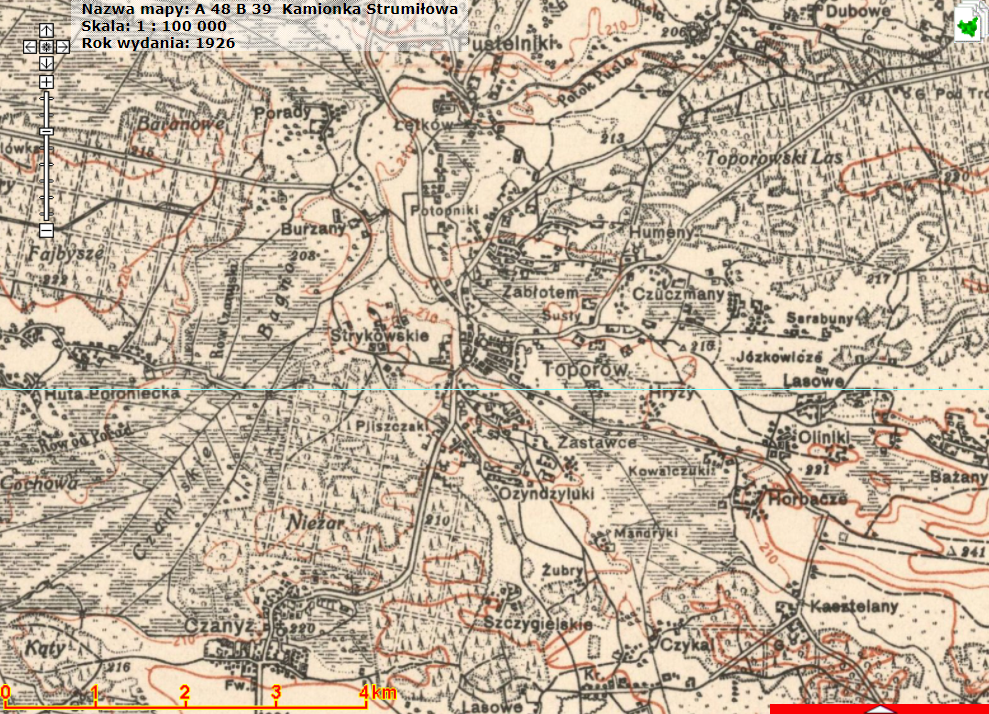
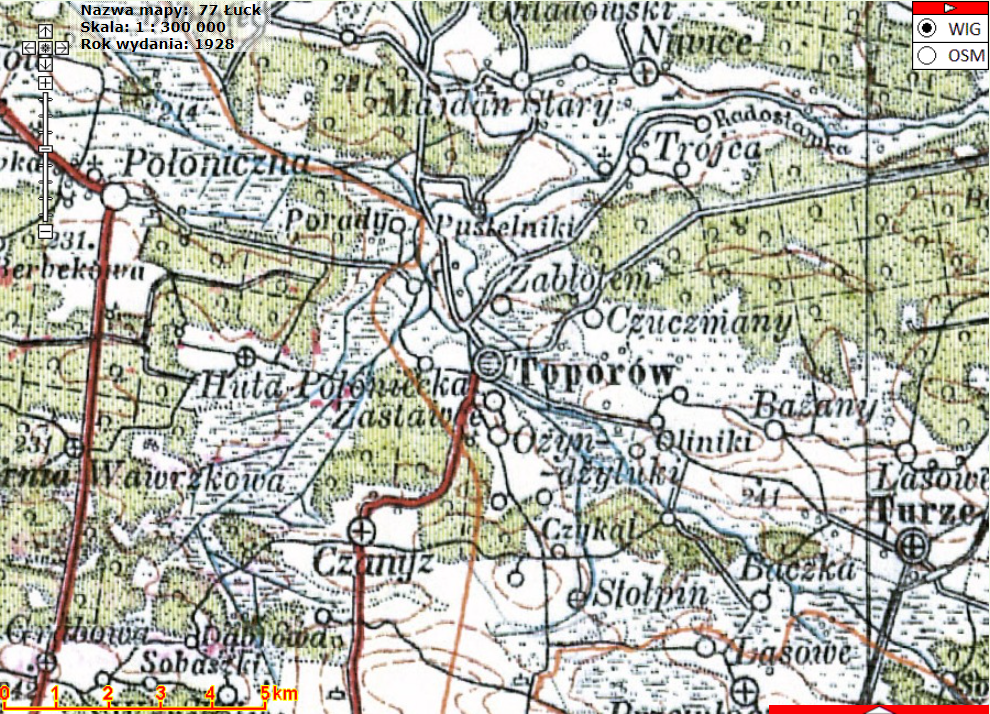
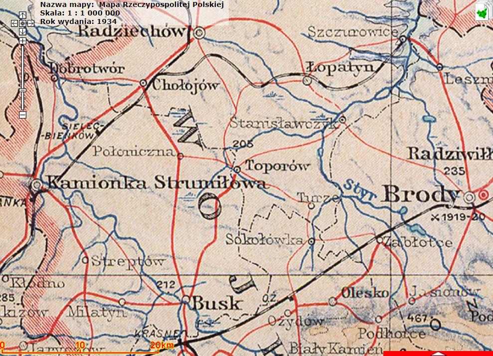

[< główna](../README.md)
# Toporów (ukr. топорів, Toporiw)
Wieś (dawniej miasto) w zachodniej Ukrainie w rejonie buskim obwodu lwowskiego. W II Rzeczypospolitej miejscowość była siedzibą gminy wiejskiej Toporów w powiecie radziechowskim województwa tarnopolskiego.

+ Google Maps: [https://www.google.com/maps](https://www.google.com/maps/place/Topor%C3%B3w,+Obw%C3%B3d+lwowski,+Ukraina,+80520/@50.1084756,24.7296433,13.75z/data=!4m5!3m4!1s0x47254958b3a2f73b:0xc8070f6b300a24bc!8m2!3d50.106334!4d24.7284894)
+ Słownik geograficzny Królestwa Polskiego: [http://dir.icm.edu.pl/pl/Slownik_geograficzny/Tom_XII/399](http://dir.icm.edu.pl/pl/Slownik_geograficzny/Tom_XII/399)

## Nazwiska
+ Babijczuk
+ Bartoszek
+ Byra
+ Kowalczuk
+ Szczygielski / Szczygielska
+ Zabawa

## Metryki
+ AGAD: [http://www.agad.gov.pl/inwentarze/KLwo301new.xml](http://www.agad.gov.pl/inwentarze/KLwo301new.xml):
    + 1827-1828 UMZ [http://agadd.home.net.pl/metrykalia/301/sygn.%201383/indeks.htm](http://agadd.home.net.pl/metrykalia/301/sygn.%201383/indeks.htm)
    + 1871, 1872, 1880, 1892 UMZ [http://agadd.home.net.pl/metrykalia/301/sygn.%201808/indeks.htm](http://agadd.home.net.pl/metrykalia/301/sygn.%201808/indeks.htm)
+ CDIAL: [https://tsdial.archives.gov.ua/index16.html](https://tsdial.archives.gov.ua/index16.html):
    + 1817-1824 UMZ [https://tsdial.archives.gov.ua/EA%20pdf/618/618-2-468.pdf](https://tsdial.archives.gov.ua/EA%20pdf/618/618-2-468.pdf)
    + 1825-1832 UMZ [https://tsdial.archives.gov.ua/EA%20pdf/618/618-2-469.pdf](https://tsdial.archives.gov.ua/EA%20pdf/618/618-2-469.pdf)
    + 1833-1839 UMZ [https://tsdial.archives.gov.ua/EA%20pdf/618/618-2-470.pdf](https://tsdial.archives.gov.ua/EA%20pdf/618/618-2-470.pdf)
    + 1840-1845 UMZ [https://tsdial.archives.gov.ua/EA%20pdf/618/618-2-471.pdf](https://tsdial.archives.gov.ua/EA%20pdf/618/618-2-471.pdf)
    + 1846-1850 UMZ [https://tsdial.archives.gov.ua/EA%20pdf/618/618-2-472.pdf](https://tsdial.archives.gov.ua/EA%20pdf/618/618-2-472.pdf)
    + 1851-1859 UMZ [https://tsdial.archives.gov.ua/EA%20pdf/618/618-2-473.pdf](https://tsdial.archives.gov.ua/EA%20pdf/618/618-2-473.pdf)
    + 1860-1867 UMZ [https://tsdial.archives.gov.ua/EA%20pdf/618/618-2-474.pdf](https://tsdial.archives.gov.ua/EA%20pdf/618/618-2-474.pdf)
+ FamilySearch (skany z CDIAL i Archiwum "Baziaka"): [https://www.familysearch.org/search/catalog/results?count=20&query=%2Bsubject_id%3A737830](https://www.familysearch.org/search/catalog/results?count=20&query=%2Bsubject_id%3A737830)

## Indeksy
W trakcie przygotowywania

## Linki
+ Polska 1926. Portret zbiorowy II RP:
    + Toporów [http://www.polska1926.pl/karty/19097](http://www.polska1926.pl/karty/19097)
    + Stołpin [http://www.polska1926.pl/karty/19085](http://www.polska1926.pl/karty/19085) 
+ Na styku kultur i narodów. Galicyjskie miasta i miasteczka w józefińskim katastrze gruntowym, Tom VIII: Kamionka Strumiłowa i Toporów, opracował Krzysztof Ślusarek, Kraków 2018 (ISBN 978- 83-65080-94-3; DOI: 10.32021/2018KS45277KS) [http://www.miasta-galicji.pl/assets/materialy/Tom_08_Kamionka_Toporow.pdf](http://www.miasta-galicji.pl/assets/materialy/Tom_08_Kamionka_Toporow.pdf)

## Mapy
1926 rok:

1928 rok: 

1934 rok:

