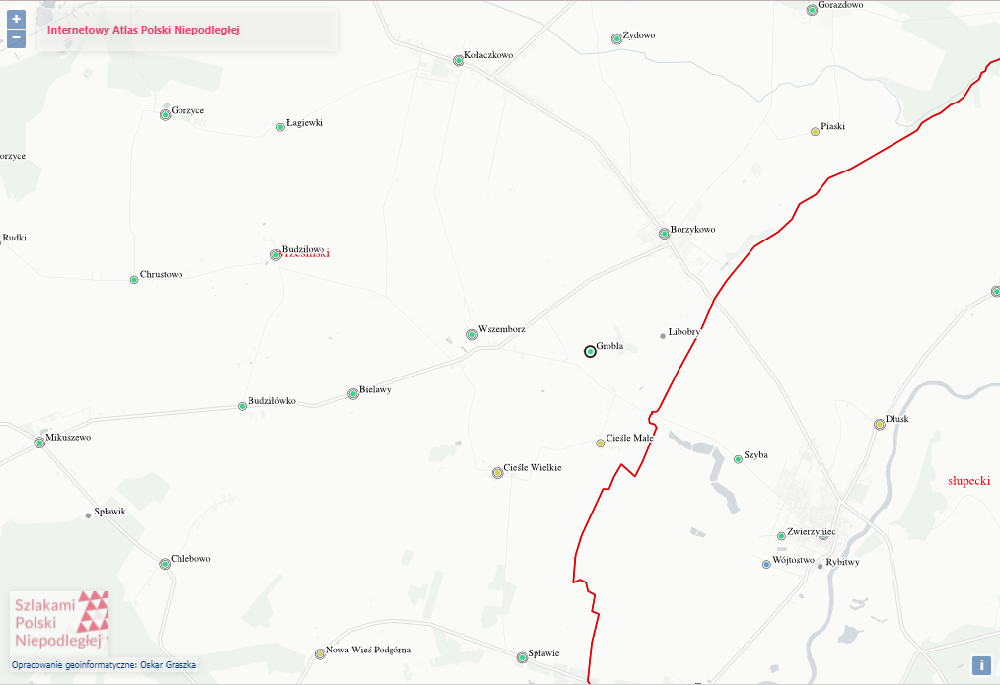
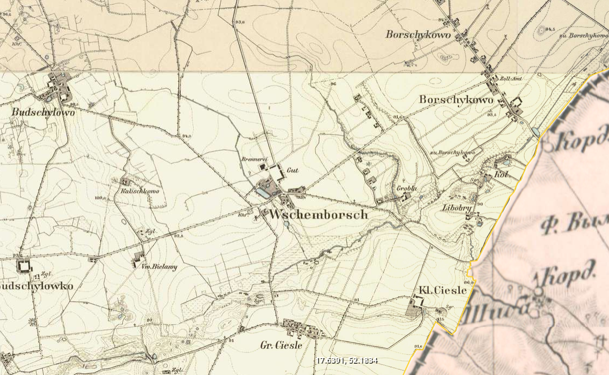

# Wszembórz
## Nazwiska

## Metryki

## Indeksy
+ Geneteka: https://geneteka.genealodzy.pl/index.php?op=gt&lang=pol&bdm=B&w=15wp&rid=9325

## Linki

## Lokalizajca
+ Internetowy Atlas Polski Niepodległej

+ Europe in the XIX. century
https://maps.arcanum.com/en/map/europe-19century-secondsurvey/?bbox=1953683.3488656618%2C6830493.142517307%2C1971865.8069689982%2C6837152.718606654&layers=osm%2C158%2C164&utm_source=Histmag.org&utm_medium=article-18201

